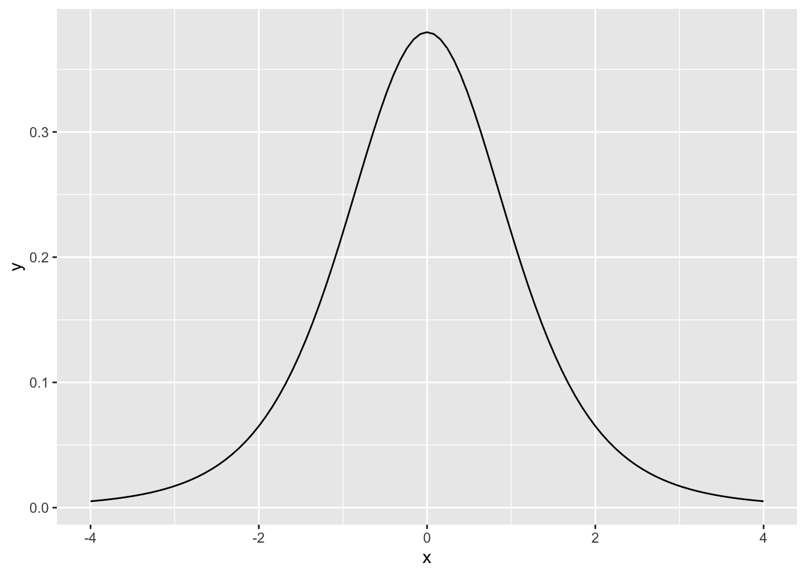
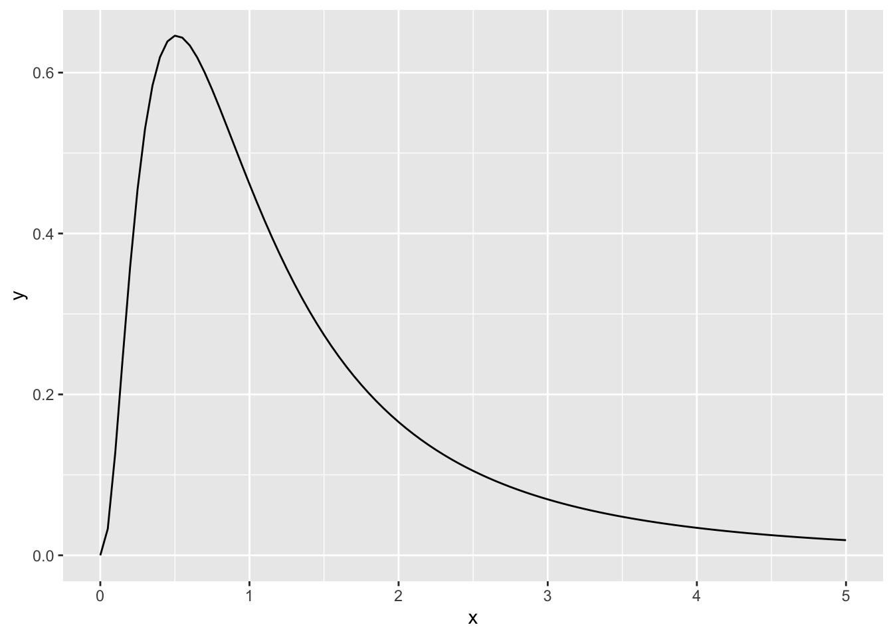

## Graphing Normal and T Distributions


Normal Distribution:

::: {.cell}

```{.r .cell-code}
normdist <- ggplot(data.frame(x = c(-4, 4)), aes(x = x)) +
        stat_function(fun = dnorm)
normdist
```

::: {.cell-output-display}
{width=672}
:::
:::

T Distribution:

::: {.cell}

```{.r .cell-code}
tdist <- ggplot(data.frame(x = c(-4, 4)), aes(x = x)) +
        stat_function(fun = dt, args = list(df = 5))
tdist
```

::: {.cell-output-display}
{width=672}
:::
:::


Plotting T and Normal Distribution (Standard Normal in Red, T in Blue):

::: {.cell}

```{.r .cell-code}
bothdist <- ggplot(data.frame(x=c(-4,4)),aes(x=x)) + 
  stat_function(fun=dnorm,color="red") + 
  stat_function(fun=dt,args=list(df=5),color="blue")
bothdist
```

::: {.cell-output-display}
{width=672}
:::
:::


Plotting F Distribution:

::: {.cell}

```{.r .cell-code}
fdist <- ggplot(data.frame(x=c(0,5)),aes(x=x)) + 
  stat_function(fun=df, args=list(7,5))
fdist
```

::: {.cell-output-display}
{width=672}
:::
:::