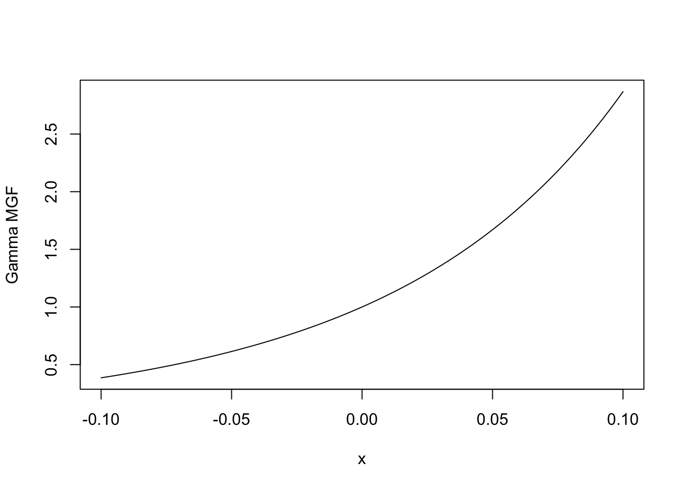

I'm testing out how to use [Quarto](https://quarto.org) with R and R Markdown, and seeing if it integrates with my website, so I can create posts through it and become better at R while working on homework and whatnot.

::: {.cell}

```{.r .cell-code}
z_scores <- 1:3
pnorm(z_scores) - pnorm(-z_scores)
```

::: {.cell-output .cell-output-stdout}
```
[1] 0.6826895 0.9544997 0.9973002
```
:::
:::


::: {.cell}

```{.r .cell-code}
mgamma(1:4,shape=10,rate=1)
```

::: {.cell-output .cell-output-stdout}
```
[1]    10   110  1320 17160
```
:::

```{.r .cell-code}
plot(function(x){mgfgamma(x,shape=10,rate=1)}, from=-0.1, to=0.1, ylab="Gamma MGF")
```

::: {.cell-output-display}
{width=672}
:::
:::